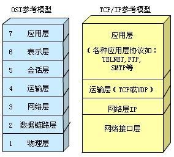
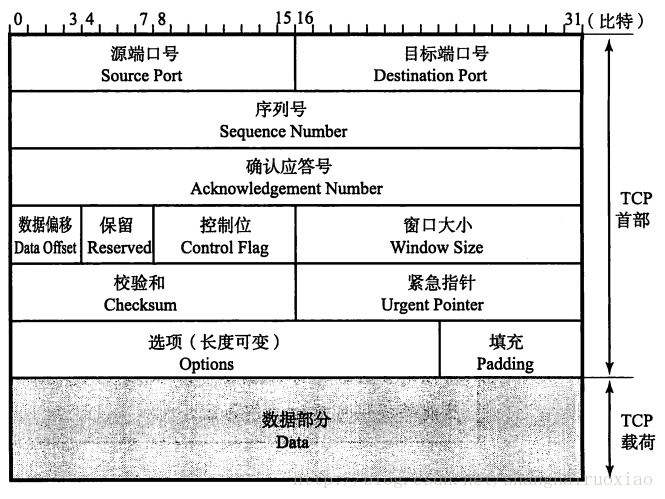
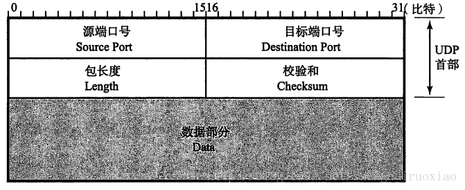
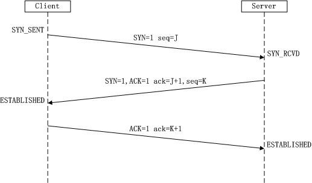

## 网络与TCP/IP

参考书籍：《图解TCP/IP》，《TCP/IP详解 卷一》，《图解HTTP》，《HTTP权威指南》

### TCP/IP协议分层

参考：[TCP协议详解](https://www.jianshu.com/p/ef892323e68f) 



TCP 负责应用软件和网络软件之间的通信，IP 负责计算机之间的通信；TCP 将数据分割并装入 IP 包，然后在它们到达的时候重新组合它们，IP 负责将包发送至接受者；TCP/IP协议族按照层次由上到下，一般划分为3~5层：

- **应用层**:
  向用户提供一组常用的应用程序，比如电子邮件、文件传输访问、远程登录等
- **传输层**:
  提供应用程序间的通信。其功能包括：格式化信息流；提供可靠传输。为实现后者，传输层协议规定接收端必须发回确认，并且假如分组丢失，必须重新发送
- **网络层** ：
  负责相邻计算机之间的通信
  - 处理来自传输层的分组发送请求，收到请求后，将分组装入IP数据报，填充报头，选择去往信宿机的路径，然后将数据报发往适当的网络接口
  - 处理输入数据报：首先检查其合法性，然后进行寻径：假如该数据报已到达信宿机，则去掉报头，将剩下部分交给适当的传输协议；否则转发该数据报
  - 处理路径、流控、拥塞等问题
- **网络接口层**：
  这是TCP/IP软件的最低层，负责接收IP数据报并通过网络发送之，或者从网络上接收物理帧，抽出IP数据报，交给IP层。

### TCP与UDP

参考：[TCP/IP(5)--TCP与UDP](https://blog.csdn.net/shanghairuoxiao/article/details/68927070) 

- IP协议与传输层
  - IP协议提供的是不可靠的传输协议，它只是尽力将数据发送到目标主机，但是如果数据丢包，数据损坏，它都不能提供任何解决办法；
  - IP协议只是将数据发送到了目标主机，但是应该由哪个应用程序来接受这个数据包呢？IP协议没有办法告诉我们。 
    传输层的作用就是为了实现以上两点目的。

- 传输层协议

  - TCP概述：TCP 协议是面向有连接的协议，一般情况下建立连接需要三步，关闭连接需要四步。有数据重传、流量控制等功能，TCP 协议能够正确处理丢包问题，保证接收方能够收到数据，能够有效利用网络带宽。然而 TCP 协议中定义了很多复杂的规范，因此效率不如 UDP 协议，不适合实时的视频和音频传输

  - UDP概述： UDP 协议是面向无连接的协议，它只会把数据传递给接收端，但是不会关注接收端是否真的收到了数据。这种特性适合多播，实时的视频和音频传输。传输层无法保证数据的可靠传输，只能通过应用层来实现

  - IP 协议中，包括IP首部中的**协议号**，**源 IP 地址**和**目标 IP 地址**；传输层协议新增了**目标端口号**和**源端口号**两个关键要素。

  - TCP和UDP区别：

    1. TCP基于有连接，UDP基于无连接
    2. TCP能保证可靠传输(有连接，超时重传，应答机制)，UDP不能保证可靠传输
    3. TCP结构复杂，消耗资源多，建立过程慢；UDP结构简单，消耗资源少，建立过程快
    4. TCP连接只能是点到点，而UDP可以一对一，一对多或者多对多
    5. TCP基于流模式，UDP是数据报模式。TCP把数据看成一连串无结构的字节流，没有边界，一段段传输构成整个数据块。通过发送缓冲区和接受缓冲区来存储数据流；而UDP数据报模式，每一个数据报都是一个独立的对象，有着指定的大小
    6. TCP可以实现流量控制(确认，重传，拥塞控制机制)，UDP在没有建立连接或者对方已经退出的情况下任然会继续发送数据，导致通信流量的浪费

  - TCP首部

    

    - **源端口号：**发送端端口号

    - **目标端口号：**接受端端口号

    - **序列号：**发送数据时，表示发送数据的位置，发送完一次数据后，序列号的值都等于原来的序列号加上数据的长度

    - **应答号：**用于接受端告诉发送端下次发送位置，表示前面的数据已经都收到了

    - **数据偏移：**实际就是TCP首部长度

    - **保留：**一般设置为0，用于后续扩展

    - **控制位：**长度为8，依次是CWR，ECE，URG，ACK，PSH，RST，SYN，FIN

      | 标志 | 含义                                                         |
      | ---- | ------------------------------------------------------------ |
      | URG  | 紧急标志。紧急标志为"1"表明该位有效                          |
      | ACK  | 确认标志。表明确认编号栏有效，提示远端系统已经成功接收所有数据 |
      | PSH  | 推标志。该标志置位时，接收端不将该数据进行队列处理，而是尽可能快地将数据转由应用处理。在处理Telnet或rlogin等交互模式的连接时，该标志总是置位的 |
      | RST  | 复位标志。用于复位相应的TCP连接                              |
      | SYN  | 同步标志。表明同步序列编号栏有效，仅在三次握手建立TCP连接时有效 |
      | FIN  | 结束标志                                                     |

    - **窗口大小：**能够发送数据的最大值，为0时可以发送探测窗口

    - **校验和：**与UDP校验和作用相同

    - **紧急指针：**用于处理紧急情况

    - **选项：**其他控制设置

  - UDP首部

    

    - **源端口号**：表示发送端端口号，不需要时设为0
    - **目标端口号：**表示接收端端口号
    - **包长度：**表示整个UDP包的长度
    - **校验和：**为了提供可靠的UDP首部和数据而设计，只要源IP地址，目标IP地址，源端口号，目标端口号，协议号有一个发生了篡改校验和都会不正确

- 端口号

  用于区分同一台主机中正在通信的不同应用程序，因此也被称为程序地址。

  - 知名端口号：端口号是固定的，用于服务器程序

  - 动态端口号：端口号是不固定的，用于客户端程序

  | 端口号 | 协议    |
  | ------ | ------- |
  | 20     | FTP数据 |
  | 21     | FTP控制 |
  | 23     | SSH     |
  | 25     | SMTP    |
  | 53     | DNS     |
  | 80     | HTTP    |


### TCP协议详解

参考：[TCP/IP(6)--协议详解](https://blog.csdn.net/shanghairuoxiao/article/details/68927100)   [TCP协议详解](https://www.jianshu.com/p/ef892323e68f) 

- TCP的三次握手：建立一个TCP连接时，需要客户端和服务端总共发送3个包以确认连接的建立；在socket编程中，这一过程由客户端执行connect来触发，流程如下

  

  - 第一次握手：Client将标志位SYN置为1，随机产生一个值seq=J，并将该数据包发送给Server，Client进入SYN_SENT状态，等待Server确认
  - 第二次握手：Server收到数据包后由标志位SYN=1知道Client请求建立连接，Server将标志位SYN和ACK都置为1，ack=J+1，随机产生一个值seq=K，并将该数据包发送给Client以确认连接请求，Server进入SYN_RCVD状态
  - 第三次握手：Client收到确认后检查ack=J+1，ACK=1，如果正确则将标志位ACK置为1，ack=K+1，并将该数据包发送给Server，Server检查ack=K+1，ACK=1，如果正确则连接建立成功，Client和Server进入ESTABLISHED状态，完成三次握手

  **建立连接**：建立连接时，客户端发送SYN包（SYN=i）到服务器，并进入到SYN-SEND状态，等待服务器确认；服务器收到SYN包，必须确认客户的SYN（ack=i+1）,同时自己也发送一个SYN包（SYN=k）,即SYN+ACK包，此时服务器进入SYN-RECV状态；客户端收到服务器的SYN+ACK包，向服务器发送确认报ACK（ack=k+1），此包发送完毕，客户端和服务器进入ESTABLISHED状态，完成三次握手，客户端与服务器开始传送数据。

  **SYN攻击**：在三次握手过程中，Server发送SYN-ACK之后，收到Client的ACK之前的TCP连接称为**半连接（half-open connect）**，此时Server处于SYN_RCVD状态，当收到ACK后，Server转入ESTABLISHED状态。SYN攻击就是Client在短时间内伪造大量不存在的IP地址，并向Server不断地发送SYN包，Server需要不断重发确认包并等待Client的确认，直至超时，这些伪造的SYN包将长时间占用未连接队列，导致正常的SYN请求因为队列满而被丢弃，从而引起网络堵塞甚至系统瘫痪。SYN攻击时一种典型的DDOS攻击，检测SYN攻击的方式非常简单，即当Server上有大量半连接状态且源IP地址是随机的，则可以断定遭到SYN攻击了，使用如下命令可以让之现行

  ```
  #netstat -nap | grep SYN_RECV
  ```

- [**TCP**三次握手与四次挥手](https://link.zhihu.com/?target=http%3A//blog.csdn.net/shanghairuoxiao/article/details/68927100)

- [详细说明TCP状态迁移过程](https://link.zhihu.com/?target=http%3A//blog.csdn.net/shanghairuoxiao/article/details/68927100) 
  (1) 三次握手和四次挥手状态变化； 
  (2) 2MSL是什么状态？作用是什么？ 
  (3)三次握手为什么不是两次或者四次？

- [TCP相关技术](https://link.zhihu.com/?target=http%3A//blog.csdn.net/shanghairuoxiao/article/details/68927100)

1. TCP重发机制，Nagle算法
2. TCP的拥塞控制使用的算法和具体过程
3. TCP的窗口滑动

- [TCP客户与服务器模型，用到哪些函数](https://link.zhihu.com/?target=http%3A//blog.csdn.net/shanghairuoxiao/article/details/69803044)
- [UDP客户与服务器模型，用到哪些函数](https://link.zhihu.com/?target=http%3A//blog.csdn.net/shanghairuoxiao/article/details/69951345)
- [域名解析过程，ARP的机制，RARP的实现](https://link.zhihu.com/?target=http%3A//blog.csdn.net/shanghairuoxiao/article/details/68926923)
- Ping和TraceRoute实现原理

### HTTP

- **http/https 1.0、1.1、2.0的特点和区别**
- **get/post 区别**
- **HTTP返回状态码**
- **http 协议头相关**

http数据由请求行，首部字段，空行，报文主体四个部分组成 
首部字段分为：通用首部字段，请求首部字段，响应首部字段，实体首部字段

- **https与http的区别？如何实现加密传输？加解密方式？**
- **浏览器中输入一个URL发生什么，用到哪些协议？**

](http://www.cnblogs.com/smiler/p/4457622.html)